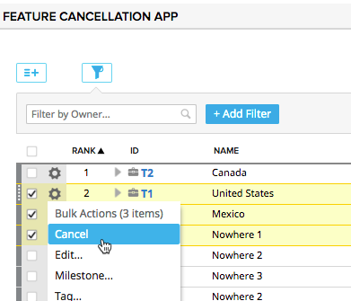

# Feature Cancellation App

## Summary/Description

Highly customized app to allow for bulk "Canceling" of a Portfolio Item (Not recommended for re-distribution).  

The "Cancel" menu item will only be available if all of the items selected are NOT in the configured "Completed States".

If a portfolio item is cancelled, then all of the items in its tree will be updated as follows:
1.  Portfolio Items will be set to a state of "Cancelled" if they aren't already in a "Completed State"
2.  If the user story is not already in Completed or greater state, User Story names will be prefixed with the string "[CANCELLED] "
3.  Leaf User Stories will get the following updates if the user story is not already in completed or greater state:
    * Plan Estimate set to 0
    * Schedule State set to configured "Canceled Schedule State"
    * Release set to configured "Canceled Release" (if it exists in the project the item is in)
4.  Task To Do will be set to 0 for any tasks below the canceled item (even if the story is set to complete)

## App Settings:
The following items can be configured in the app:
* Artifact Type - the Portfolio Item type at the root of the grid
* Canceled Release Name - the name of the "Canceled Release" to set canceled stories to.  If there is no release matching this name in the items project, then no release will be assigned.  
* Canceled Schedule State - the Schedule State to set "canceled" stories to
* Completed Portfolio States - select all states that represent completed portfolio items.  The state for any portfolio items in this state will not be updated to "Cancelled"

## Caveats
If there is no "Cancelled"  State for portfolio items, then the state will not be updated when they are cancelled.  

## Development Notes

### First Load

If you've just downloaded this from github and you want to do development,
you're going to need to have these installed:

 * node.js
 * grunt-cli
 * grunt-init

Since you're getting this from github, we assume you have the command line
version of git also installed.  If not, go get git.

If you have those three installed, just type this in the root directory here
to get set up to develop:

  npm install

### Structure

  * src/javascript:  All the JS files saved here will be compiled into the
  target html file
  * src/style: All of the stylesheets saved here will be compiled into the
  target html file
  * test/fast: Fast jasmine tests go here.  There should also be a helper
  file that is loaded first for creating mocks and doing other shortcuts
  (fastHelper.js) **Tests should be in a file named <something>-spec.js**
  * test/slow: Slow jasmine tests go here.  There should also be a helper
  file that is loaded first for creating mocks and doing other shortcuts
  (slowHelper.js) **Tests should be in a file named <something>-spec.js**
  * templates: This is where templates that are used to create the production
  and debug html files live.  The advantage of using these templates is that
  you can configure the behavior of the html around the JS.
  * config.json: This file contains the configuration settings necessary to
  create the debug and production html files.  
  * package.json: This file lists the dependencies for grunt
  * auth.json: This file should NOT be checked in.  Create this to create a
  debug version of the app, to run the slow test specs and/or to use grunt to
  install the app in your test environment.  It should look like:
    {
        "username":"you@company.com",
        "password":"secret",
        "server": "https://rally1.rallydev.com"
    }

### Usage of the grunt file
####Tasks

##### grunt debug

Use grunt debug to create the debug html file.  You only need to run this when you have added new files to
the src directories.

##### grunt build

Use grunt build to create the production html file.  We still have to copy the html file to a panel to test.

##### grunt test-fast

Use grunt test-fast to run the Jasmine tests in the fast directory.  Typically, the tests in the fast
directory are more pure unit tests and do not need to connect to Rally.

##### grunt test-slow

Use grunt test-slow to run the Jasmine tests in the slow directory.  Typically, the tests in the slow
directory are more like integration tests in that they require connecting to Rally and interacting with
data.

##### grunt deploy

Use grunt deploy to build the deploy file and then install it into a new page/app in Rally.  It will create the page on the Home tab and then add a custom html app to the page.  The page will be named using the "name" key in the config.json file (with an asterisk prepended).

To use this task, you must create an auth.json file that contains the following keys:
{
    "username": "fred@fred.com",
    "password": "fredfredfred",
    "server": "https://us1.rallydev.com"
}

(Use your username and password, of course.)  NOTE: not sure why yet, but this task does not work against the demo environments.  Also, .gitignore is configured so that this file does not get committed.  Do not commit this file with a password in it!

When the first install is complete, the script will add the ObjectIDs of the page and panel to the auth.json file, so that it looks like this:

{
    "username": "fred@fred.com",
    "password": "fredfredfred",
    "server": "https://us1.rallydev.com",
    "pageOid": "52339218186",
    "panelOid": 52339218188
}

On subsequent installs, the script will write to this same page/app. Remove the
pageOid and panelOid lines to install in a new place.  CAUTION:  Currently, error checking is not enabled, so it will fail silently.

##### grunt watch

Run this to watch files (js and css).  When a file is saved, the task will automatically build, run fast tests, and deploy as shown in the deploy section above.

##### grunt --help  

Get a full listing of available targets.
